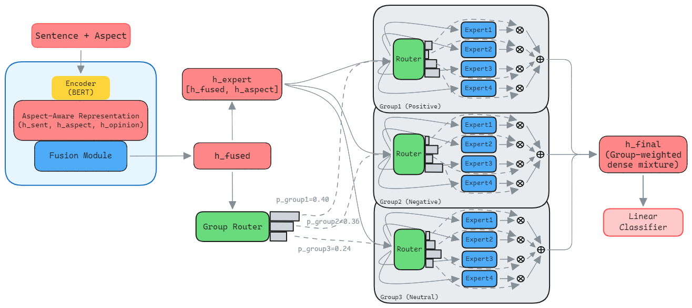
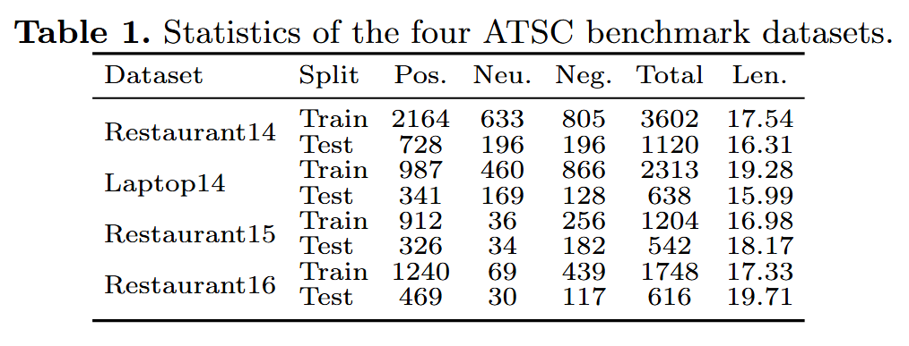
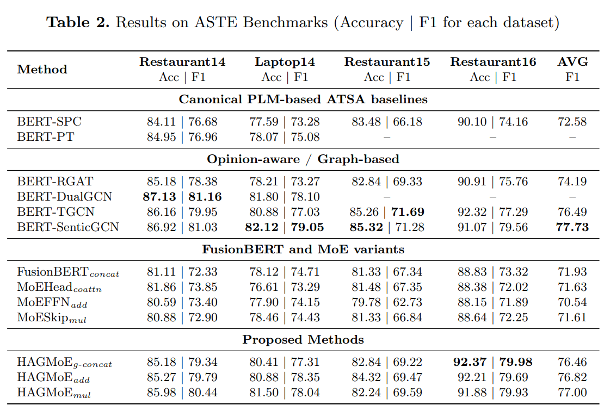
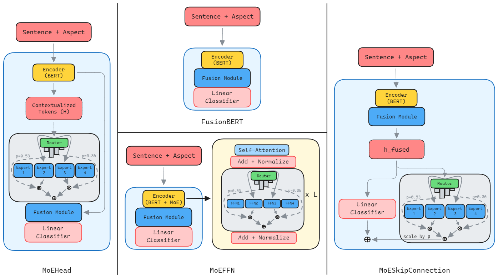
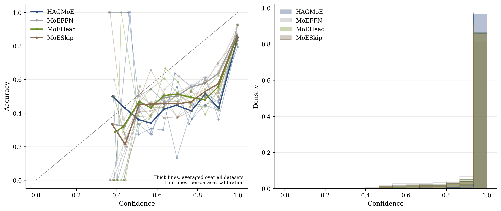

# HAGMoE

Hierarchical Aspect-Guided Mixture-of-Experts (HAGMoE) for aspect-based sentiment classification, with multiple baselines and MoE variants.

## Overview

### HAGMoE architecture


### Data distribution


### Model benchmark summary


### MoE variants comparison


### Training regime and calibration


## Repository structure

```text
hagmoe/
|-- data/                    # ABSA datasets (Lap14, Rest14, Rest15, Rest16)
|-- images/                  # Figures used in this README
|-- requirements.txt
`-- README.md
```

## Requirements

- Python 3.12+ recommended
- PyTorch-compatible environment (GPU optional, scripts default to CUDA if available)
- Bash shell for `scripts/*.sh` (Linux/macOS/WSL/Git Bash)

Install Python dependencies:

```bash
pip install -r requirements.txt
```

## Setup

1. Create and activate a virtual environment.

```bash
python -m venv .venv
source .venv/bin/activate
```

On Windows PowerShell:

```powershell
python -m venv .venv
.venv\Scripts\Activate.ps1
```

2. Install dependencies.

```bash
pip install -r requirements.txt
```


## Run training

All provided scripts call `python -m main` with the correct flags.

- `LOSS_TYPE`: `ce | weighted_ce | focal`
- `DATASET_TYPE`: `laptop14 | lap14 | rest14 | rest15 | rest16`

### Base model

```bash
bash scripts/run_base_model.sh ce laptop14
```

### BERT-SPC

```bash
bash scripts/run_bert_spc_model.sh weighted_ce rest14
```

### HAGMoE

```bash
bash scripts/run_hagmoe_model.sh focal rest16
```

### MoE variants

```bash
bash scripts/run_moe_ffn.sh ce rest14
bash scripts/run_moe_head.sh weighted_ce rest15
bash scripts/run_moe_skip.sh focal lap14
```

## Outputs

- Logs: `logs/`
- Main results JSON: `results/<dataset_type>/...`
- Tuning results: `results/loss_tuning/...`
- Per-run artifacts (metrics/confusion/calibration/MoE plots) are saved under `results/.../<mode>/<method>/<loss_type>/seed_*/fold_*/`.


